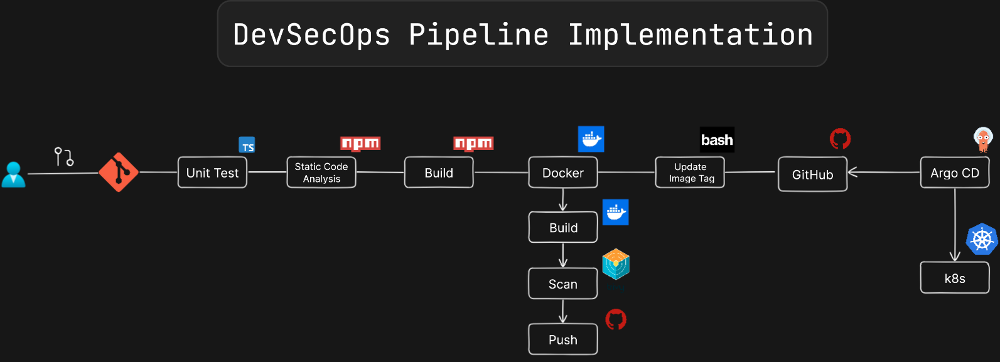

# DevSecOps CICD-TikTacToe-Game Applications

This project demonstrates the implementation of a fully automated DevSecOps pipeline that integrates security, CI/CD, containerization, and infrastructure-as-code (IaC) practices for modern application delivery.

## 🔧 Key Features

- ✅ Jenkins CI/CD Pipeline
- 🐳 Dockerized Application Build
- 📦 Container Image Scanning with Trivy
- 🔍 Code Quality Check via SonarQube
- 🚀 Kubernetes Deployment
- 📊 Monitoring with Prometheus & Grafana
- 📬 Slack/Email Notifications

## Image Taken while doing this project 

## Pipeline Stages

1. Code Push to GitHub
2. Jenkins CI Build
3. Static Code Analysis (SonarQube)
4. Image Scanning (Trivy)
5. Container Build & Push (Docker)
6. Deployment to Kubernetes
7. Monitoring Setup (Prometheus, Grafana)

## How the Kubernetes Deployment Update Works

The "Update Kubernetes Deployment" stage:

1. Runs only on pushes to the main branch
2. Uses a shell script to update the image reference in the Kubernetes deployment file
3. Commits and pushes the updated deployment file back to the repository
4. This ensures that the Kubernetes manifest always references the latest image

## Required Secrets

The workflow requires the following GitHub secrets:

- `GITHUB_TOKEN` - Automatically provided by GitHub Actions, used for pushing to the repository and the container registry

## Continuous Deployment

For full continuous deployment, you would need to:

1. Set up a Kubernetes operator  ArgoCD to watch for changes in the repository
2. Configure it to automatically apply changes to the Kubernetes manifests
3. This would complete the CI/CD pipeline by automatically deploying the new image to your Kubernetes cluster

📖 Blog Reference
 👉 [Check out the blog here](https://blog.nallalakshmirajyam.click/implementing-a-comprehensive-devsecops-pipeline-for-modern-applications)